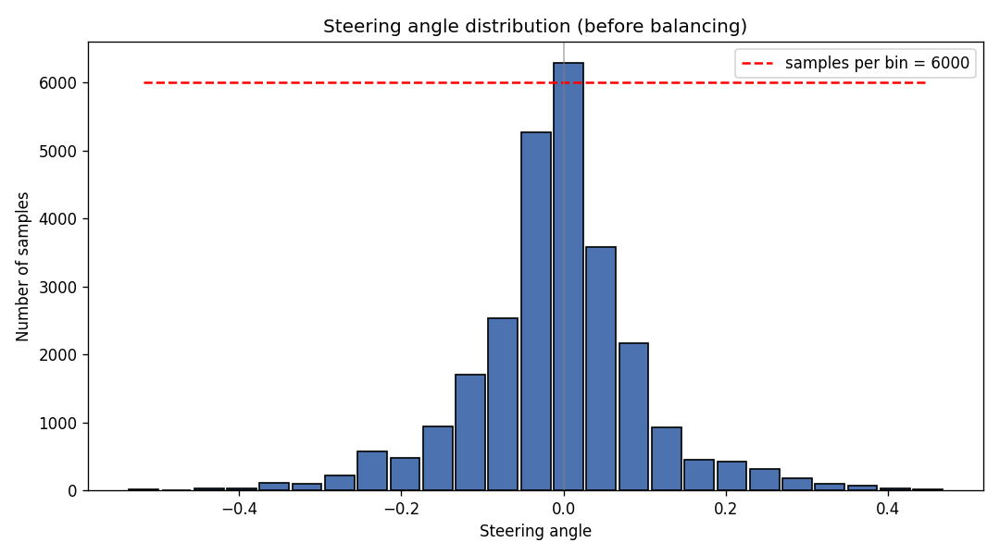
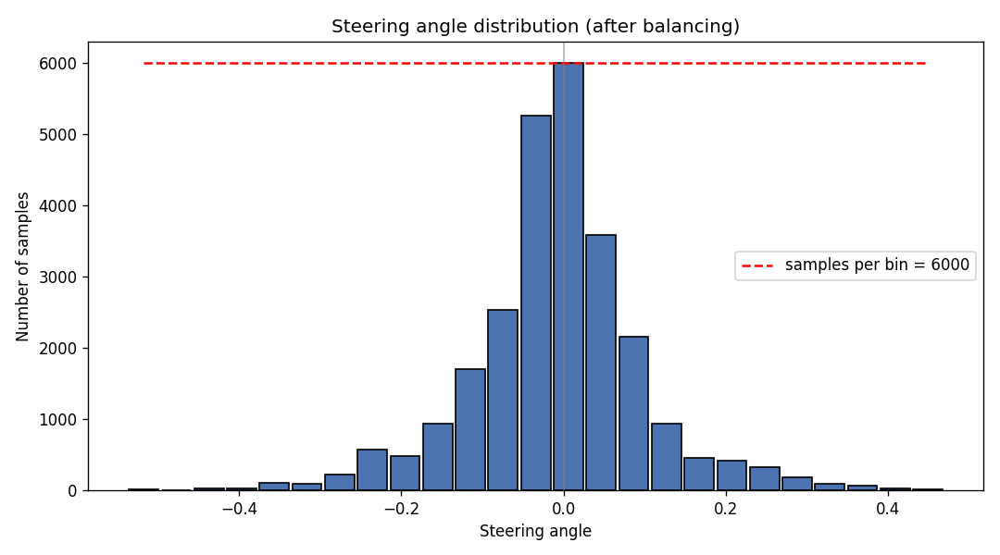
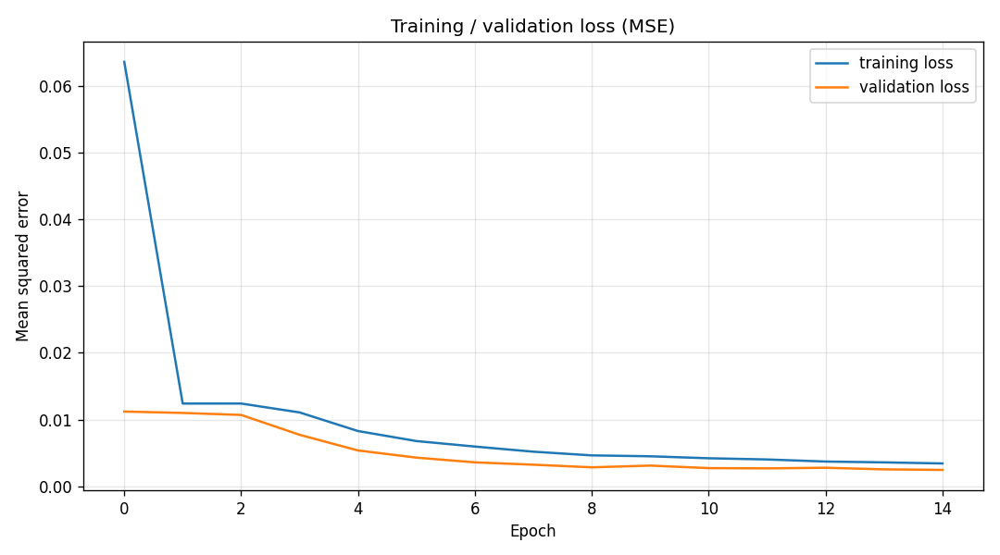

# Self-Driving Car Simulation using a CNN

DPS920 Final Project — behavioral-cloning model that predicts a steering angle
from the car's front-camera image and drives the car autonomously in the
Udacity simulator.

The network is the **Nvidia "End to End Learning for Self-Driving Cars"** CNN.
Given a preprocessed camera frame it regresses a single continuous steering
angle (supervised regression, MSE loss).

---

## 1. Approach

The full pipeline is: **collect → review & balance → augment → preprocess → batch → train → test.**

1. **Data collection** — driving the simulator in Training Mode produces an
   `IMG/` folder of camera frames and a `driving_log.csv`. We use only the
   _center_ image and the _steering_ angle. Data was collected in two sets:
   - `normal_driving/` — normal center-lane laps (both directions).
   - `recovery_driving/` — recovery maneuvers from the road edges back to center.
2. **Review & balance** — the raw data is dominated by `steering ≈ 0` (driving
   straight). We plot a histogram and cap the number of samples per bin
   (`--samples-per-bin`) so the model isn't biased toward going straight. A
   smaller cap flattens the distribution more aggressively (keeps more of the
   curve data relative to straight driving).
3. **Augmentation** (training set only) — random flip (with steering negation),
   brightness, centered zoom, pan, and a small centered rotation. Any transform
   that moves the road sideways also updates the steering label (flip negates it;
   pan shifts it in proportion to the horizontal offset) so the model learns the
   correct steering _magnitude_ and does not under-steer on curves. Rotation is
   capped at a few degrees and applied less often than the other transforms,
   because the simulator's horizon is always level.
4. **Preprocessing** — crop the road region, convert RGB→YUV, Gaussian blur,
   resize to 200×66, normalize to `[0, 1]`. Identical to the preprocessing in
   `TestSimulation.py`, so training and inference see the same image format.
5. **Batching** — a memory-efficient generator yields batches on the fly:
   randomly sampled and augmented for training, walked in order and
   un-augmented for validation.
6. **Training** — Nvidia CNN, Adam + MSE, with an 80/20 train/validation split.
7. **Testing** — `TestSimulation.py` serves the trained model over Socket.IO and
   drives the car in the simulator's Autonomous Mode.

---

## 2. Environment setup

This project runs entirely in a single **`dps920`** conda environment
(Python 3.8, macOS / Apple Silicon with Metal GPU acceleration). The pinned
package versions are required for the Udacity simulator to communicate correctly.

```bash
conda create -n dps920 python=3.8
conda activate dps920
pip install -r requirements.txt
```

> On Intel/Windows/Linux, replace the `tensorflow-macos` / `tensorflow-metal`
> lines in `requirements.txt` with `tensorflow==2.13.0`.

Always run the project scripts with this environment activated (`conda activate dps920`).

---

## 3. Project structure

```
Project/
├── src/
│   ├── data_utils.py      # load driving logs, steering histogram, balancing
│   ├── review_balance.py  # plot before/after histograms, save balanced CSV
│   ├── augmentation.py    # flip / brightness / centered zoom / pan / rotation (steering-compensated)
│   ├── preprocessing.py   # crop → YUV → blur → resize → normalize
│   ├── batching.py        # batch generator (random+augmented for training, ordered for validation)
│   ├── model.py           # Nvidia CNN (Keras)
│   └── train.py           # end-to-end training + loss plot + save model.h5 + run record
├── TestSimulation.py      # runs the model in the Udacity simulator (unchanged)
├── model.h5               # trained model (loaded by TestSimulation.py)
├── normal_driving/       # collected data: IMG/ + driving_log.csv
├── recovery_driving/      # collected data: IMG/ + driving_log.csv
├── outputs/               # histograms, previews, loss curve, balanced CSV, run_record.txt
├── requirements.txt
└── package_list.txt       # original conda package reference
```

---

## 4. How to run

Activate the environment first: `conda activate dps920`.

### 4.1 Review & balance the dataset

```bash
python src/review_balance.py --data normal_driving recovery_driving \
    --bins 25 --samples-per-bin 6000 --outputs outputs
```

Produces `outputs/steering_hist_before.png`, `outputs/steering_hist_after.png`,
and `outputs/driving_log_balanced.csv`.

### 4.2 Preview augmentation / preprocessing / batching (optional sanity checks)

```bash
python src/augmentation.py     # -> outputs/augmentation_preview.png
python src/preprocessing.py    # -> outputs/preprocessing_preview.png
python src/batching.py         # prints one train + one validation batch shape
```

**Batching** (`src/batching.py`) is not a separate step you have to run — it is
the data pipeline used _automatically_ during training. `batch_generator(...)`
yields `(images, steerings)` batches on the fly: for **training** batches it
randomly augments each image (flip / brightness / centered zoom / steering-
compensated pan / small centered rotation) before preprocessing; for
**validation** batches it walks the samples in order and only preprocesses them
(no augmentation, no random draws).
Running it directly just prints the batch shapes as a sanity check, e.g.:

```
Train batch: images (32, 66, 200, 3) (float32), steerings (32,) ...
Val batch:   images (32, 66, 200, 3) (float32), steerings (32,) ...
```

The batch size used during training is controlled by `--batch-size` in `train.py`.

### 4.3 Train

```bash
python src/train.py --data normal_driving recovery_driving \
    --bins 25 --samples-per-bin 6000 \
    --epochs 15 --batch-size 100 --steps-per-epoch 300
```

Pass the **same** `--bins` and `--samples-per-bin` as in step 4.1. The two scripts
balance the data independently, so matching them is what makes the histograms and
the trained model describe the same dataset.

Saves the trained model to `model.h5` (project root), the loss curve to
`outputs/training_loss.png`, and `outputs/run_record.txt` — a record of the
dataset, bin settings, seed, sample counts, hyperparameters and final losses that
produced that model, so a saved `model.h5` can always be traced back to its run.

`--validation-steps` defaults to one full pass over the validation set
(`ceil(validation_samples / batch_size)`), so `val_loss` is the mean over every
validation frame. Set it manually only if you deliberately want a shorter,
approximate validation pass. Other key options: `--learning-rate`, `--dropout`,
`--test-size` and `--seed`; a lower `--samples-per-bin` balances more
aggressively toward curves.

### 4.4 Test in the simulator

1. Start the model server:

```bash
python TestSimulation.py
```

Wait for `wsgi starting up on http://0.0.0.0:4567`.

2. Launch the simulator:

```bash
open "/path/to/beta_simulator_mac/beta_simulator_mac.app"
```

3. In the simulator: pick resolution → **Play!** → select your track →
   **AUTONOMOUS MODE**. The car connects to the server and drives itself; the
   terminal streams `throttle, steering, speed`.

Stop with `Ctrl+C` in the server terminal.

---

## To run this on Windows

You may experience these errors when running on Windows:

### 1. `TestSimulation.py` — load model without recompiling

`model.h5` was saved in the legacy Keras H5 format (from the old
TensorFlow-2.3-era environment), which stores the loss as a string
reference (`"keras.metrics.mse"`). Keras 3 can't deserialize that
reference when reconstructing the optimizer/loss config on load, and
raises:

```
ValueError: Could not deserialize 'keras.metrics.mse' because it is not a KerasSaveable subclass
```

Since `TestSimulation.py` only runs inference (no further training), the
compile config isn't needed. Fixed by loading with `compile=False`:

```python
model = load_model('model.h5', compile=False)
```

### 2. `TestSimulation.py` — fix scalar conversion of the prediction

`model.predict(...)` returns a NumPy array of shape `(1, 1)`. NumPy 2.x
removed the old behavior of allowing `float()` on any size-1 array
regardless of dimensions — only true 0-d arrays convert directly now.
This raised:

```
TypeError: only 0-dimensional arrays can be converted to Python scalars
```

Fixed by indexing out the scalar element before converting, and passing
`verbose=0` so the per-frame progress bar doesn't spam the console while
driving:

```python
steering = float(model.predict(image, verbose=0)[0][0])
```

### GPU note

TensorFlow >= 2.11 does not support GPU on native Windows (you'll see
`WARNING:tensorflow:TensorFlow GPU support is not available on native
Windows for TensorFlow >= 2.11`). This is expected — training/inference
run on CPU unless you switch to WSL2 or the TensorFlow-DirectML plugin.


## 5. Model architecture (Nvidia)

| Layer             | Details                        |
| ----------------- | ------------------------------ |
| Input             | 66 × 200 × 3 (YUV, normalized) |
| Conv2D            | 24 filters, 5×5, stride 2, ELU |
| Conv2D            | 36 filters, 5×5, stride 2, ELU |
| Conv2D            | 48 filters, 5×5, stride 2, ELU |
| Conv2D            | 64 filters, 3×3, ELU           |
| Conv2D            | 64 filters, 3×3, ELU           |
| Flatten + Dropout | dropout 0.5                    |
| Dense             | 100, ELU                       |
| Dense             | 50, ELU                        |
| Dense             | 10, ELU                        |
| Dense (output)    | 1, linear (steering angle)     |

Optimizer: **Adam**, loss: **MSE** (~252k parameters).

---

## 6. Results

- Dataset (`normal_driving` + `recovery_driving`): **26,511** center-frame
  samples. Balancing trims the straight-driving glut depending on
  `--samples-per-bin` (25 bins):

  | `--samples-per-bin` | balanced samples            |
  | ------------------- | --------------------------- |
  | 400                 | 6,007                       |
  | 800                 | 9,521                       |
  | 1,200               | 12,193                      |
  | 6,000               | 26,224 (almost no trimming) |

- Train with an 80/20 train/validation split for 15 epochs; watch
  `outputs/training_loss.png` and confirm the model reaches full steering
  magnitude on curves before testing in the simulator.

| Before balancing                            | After balancing                           |
| ------------------------------------------- | ----------------------------------------- |
|  |  |

Training loss curve:



---

## 7. Challenges & solutions

- **`model.fit` deadlock on macOS** — importing OpenCV (`cv2`) before TensorFlow
  caused a thread-pool deadlock that hung training. Fixed by importing
  TensorFlow/Keras before any `cv2`-using module in `train.py`, plus
  `cv2.setNumThreads(0)` in the augmentation/preprocessing modules.
- **Single environment for train + test** — the Udacity simulator needs an old
  Socket.IO stack (`python-socketio 4.2.1`), while modern TensorFlow needs a new
  Python. We standardized on the `dps920` env (Python 3.8 + `tensorflow-macos`),
  which supports both, so `TestSimulation.py` runs unmodified and `model.h5`
  loads natively.
- **Simulator dependency conflicts** — `eventlet 0.25.1` broke with new
  `dnspython`, and `Flask 1.1.2` broke with new `Jinja2`. Fixed by pinning
  `dnspython==1.16.0` and the Flask stack (`Jinja2 3.0.1`, `Werkzeug 2.0.1`,
  `itsdangerous 2.0.1`, `MarkupSafe 2.0.1`, `click 8.0.1`) — see `requirements.txt`.

---

## 8. Deliverables

- Python scripts: preprocessing, augmentation, batching, training, inference
  (`src/` + `TestSimulation.py`).
- Trained model: `model.h5`.
- Generated figures in `outputs/` (histograms, augmentation/preprocessing
  previews, training loss curve).
